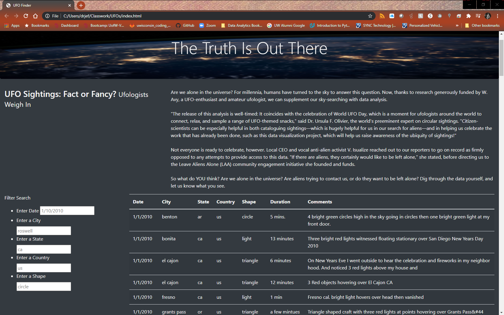
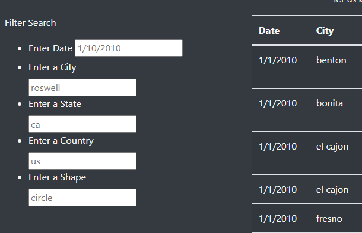
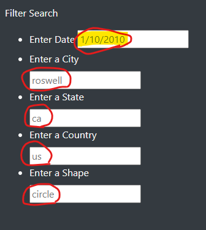
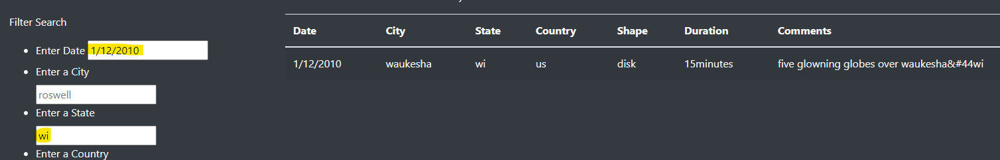

# UFOs

## Purpose of the Project
>The purpose of this project was to take an existing website with an existing dynamic table that is filterable by date of UFO sightings and adjust my existing JS code and HTML files to allow users to filter for multiple criteria at the same time. In addition to the date, I add table filters for the city, state, country, and shape.

## Results
>How to conduct a search:
>1. Once the web browser is open by running the index.html file, you will see an interactive filter in the bottom left of the page.
>
>
>"Full Page"
>
>
>
>"Filter Boxes"

>2. You may input any number of filters in the input boxes. ***MAKE SURE TO FOLLOW THE EXAMPLE SYNTAX AS PER THE PLACEHOLDER EXAMPLES.*** See image below.
>
>
>
>"Proper Syntax placeholders"
>
>3. As you enter your filter criteria and press <ENTER>, you will see the table update to match your criteria. You may continue to enter further filter criteria to narrow down your search until you have the data that you desire. The image below shows the results obtained using the "date" and "state" filters as highlighted. 
>
>
>
>4. You can reset the table and conduct another search by clicking on the "UFO Sightings" text at the upper left corner of the page. **See the below image.**
>
>

## Summary
#### Drawbacks
#### Future Development
