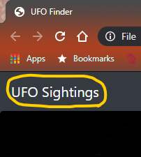

# UFOs

## Purpose of the Project
>The purpose of this project was to take an existing website with an existing dynamic table that is filterable by date of UFO sightings and adjust my existing JS code and HTML files to allow users to filter for multiple criteria at the same time. In addition to the date, I added table filters for the city, state, country, and shape.

## Results
>How to conduct a search:
>1. Once the web browser is open by running the index.html file, you will see an interactive filter in the bottom left of the page.
>
  > 
  > "Full Page"
>
  > 
>
  > "Filter Boxes"

>2. You may input any number of filters in the input boxes. ***MAKE SURE TO FOLLOW THE EXAMPLE SYNTAX AS PER THE PLACEHOLDER EXAMPLES.*** See image below.
>
  > 
>
  > "Proper Syntax placeholders"
>
>3. As you enter your filter criteria and press ENTER, you will see the table update to match your criteria. You may continue to enter further filter criteria to narrow down your search until you have the data that you desire. The image below shows the results obtained using the "date" and "state" filters as highlighted. 
>
  > 
>
>4. You can reset the table and conduct another search by clicking on the "UFO Sightings" text at the upper left corner of the page. **See the below image.**
>
  > 

## Summary
#### Drawbacks

One main concern with the existing filter is that the text must be exact. This could create filters that show as NULL results, when in fact there should be data for the specific criteria, they just don't pull due to syntax errors.

#### Future Development

One idea that may fix the problem stated above is to convert some of the text entry boxes to pull down menus that will be populated with the existing options in the database.

Another idea for future development of this project that would increase the user satisfaction with this site would be to add a "Download" button that would allow the user to capture the results of the filtered search to either a text editor file or excel/csv file.
